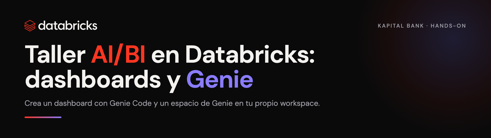

  

## Contenido

| Ruta | Qué es |
|------|--------|
| `guia/taller-aibi-hands-on.html` | Guía paso a paso (ábrela en el navegador y síguela) |
| `data/` | La data del taller como CSV: `clientes`, `tarjetas`, `transacciones`, `cobranza` |
| `notebooks/00_setup_datos.sql` | Opción A: genera las 4 tablas con SQL |
| `notebooks/01_cargar_desde_csv.py` | Opción B: carga las 4 tablas desde los CSV de `data/` |
| `prompts/genie-code-prompts.md` | Prompts listos para Genie Code (crear el dashboard) |
| `prompts/genie-space.md` | Instrucciones y preguntas para el Genie Space |

## Cómo empezar (Paso 0)

1. En tu workspace de Databricks, ve a **Workspace > (tu carpeta) > Create > Git folder**
   (o **Repos**).
2. Pega la URL de este repo y clónalo. La primera vez, Databricks te pedirá enlazar una
   **credencial de Git** (un PAT de GitHub): **Settings > Linked accounts / Git integration**.
3. Carga las tablas, con cualquiera de las dos opciones (elige un catálogo donde tengas
   permiso de **CREATE**; rara vez es `main`):
   - **Opción A:** abre `notebooks/00_setup_datos.sql`, ajusta catálogo e iniciales, **Run all**.
   - **Opción B:** abre `notebooks/01_cargar_desde_csv.py` (lee los CSV de `data/`), ajusta
     catálogo e iniciales, **Run all**.
4. Abre `guia/taller-aibi-hands-on.html` y sigue el taller.

> ¿Sin acceso a Git en el workspace? También puedes copiar el contenido de
> `notebooks/00_setup_datos.sql` directo en el **SQL Editor** y correrlo ahí.

## Los datos (carpeta `data/`)

| Tabla | Filas | Contenido |
|-------|-------|-----------|
| `clientes` | 8,000 | segmento, ciudad, país (MX/CO), edad, ingreso, estatus |
| `tarjetas` | 10,000 | tipo (Clásica → Signature), límite, saldo utilizado, estatus |
| `transacciones` | 150,000 | fecha, monto, categoría, canal, ciudad, marca de fraude (últimos 90 días) |
| `cobranza` | 3,000 | días de mora, monto vencido, tramo, probabilidad de pago, gestión |

## Agenda

1. Introducción a AI/BI Dashboards y Genie
2. Features y funcionalidades clave
3. Creación de dashboards con Genie Code
4. Creación de espacios de Genie (analítica conversacional)
5. Pruebas de Genie
6. Preguntas
